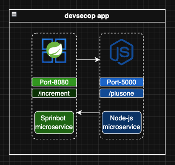
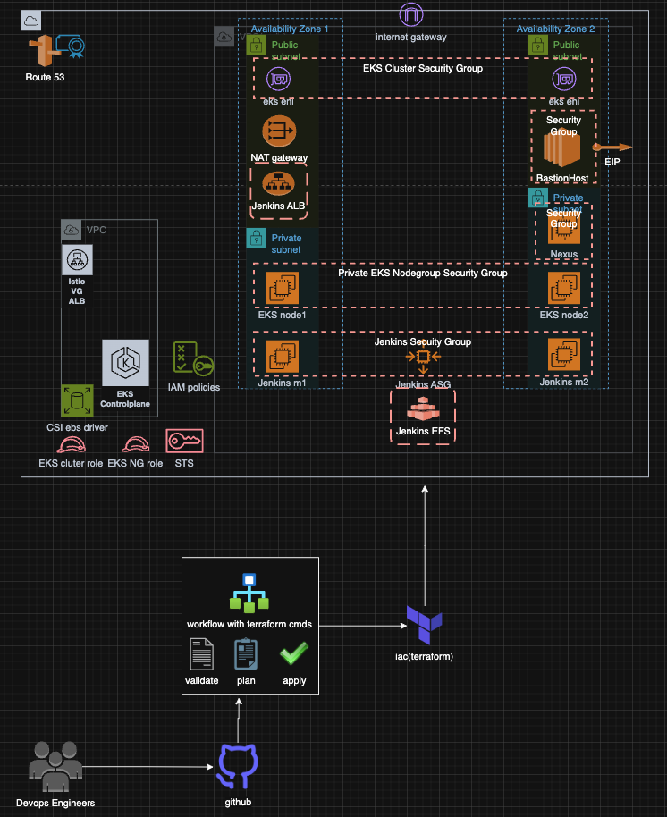
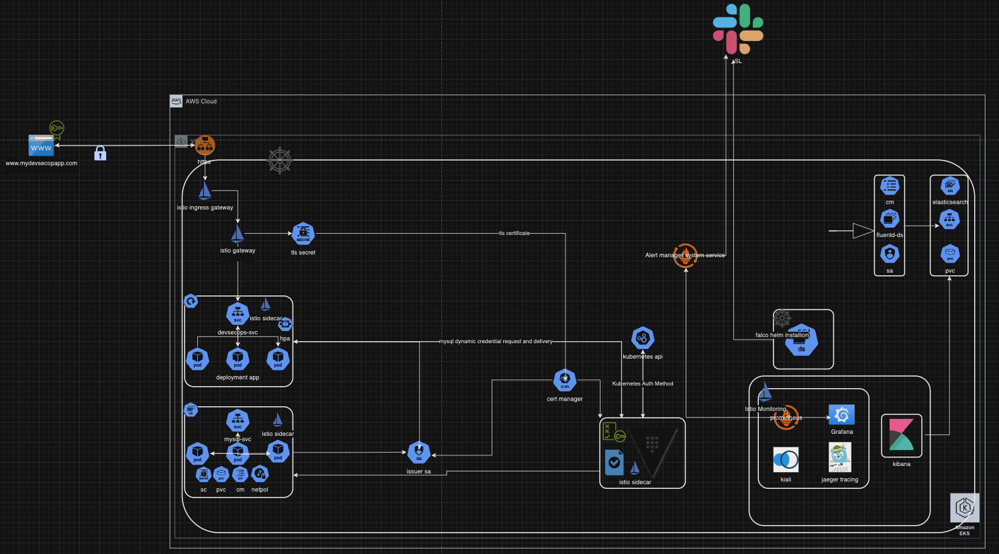
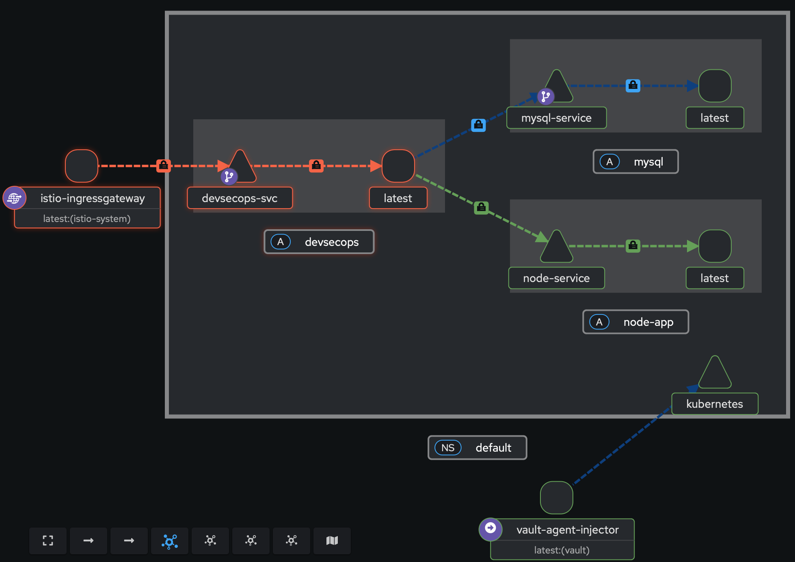

<h1>Numeric-App</h1>

  Welcome to <strong>Numeric-App</strong>, a DevOps-focused project showcasing advanced infrastructure automation, CI/CD pipelines, Kubernetes deployments, microservices communication, and security integration. This repository highlights professional-grade workflows for deploying and managing containerized applications in production-like environments.

  
  
  
  

<h2>About the Project</h2>

  <strong>Numeric-App</strong> consists of a <em>microservice architecture</em> that includes:
  <ol>
    <li><strong>Java Microservice</strong>: The primary application built using Java.</li>
    <li><strong>Node.js Microservice</strong>: A secondary service required for the Java app to function properly.</li>
  </ol>

  The project demonstrates:

<ul>
  <li><strong>Infrastructure Automation:</strong> Terraform for scalable infrastructure provisioning.</li>
  <li><strong>CI/CD Pipelines:</strong> Automated pipelines built with Jenkins.</li>
  <li><strong>Microservice Communication:</strong> Kubernetes and Docker setup to establish communication between services.</li>
  <li><strong>Security Integration:</strong> Automated compliance checks with tools like Trivy, Kube-Bench, and OPA.</li>
</ul>

  <strong>Important:</strong> Before running the Java application pipeline, ensure the Node.js microservice is running. The Java app depends on the Node.js service for its functionality.

<h2>Microservice Setup</h2>
<h3>Node.js Microservice</h3>

  The Node.js microservice can be run in two ways: using Docker or deploying it to Kubernetes.

<h4>Docker Setup</h4>

  <pre><code>docker run -p 8787:5000 mafike1/node-app:latest</code></pre>

Verify the service is running by executing:

  <pre><code>curl localhost:8787/plusone/99</code></pre>

<h4>Kubernetes Deployment</h4>

To deploy the Node.js microservice in Kubernetes:

<ol>
  <li>Create a deployment:
    

      <pre><code>kubectl create deploy node-app --image mafike1/node-app:latest</code></pre>
    

  </li>
  <li>Expose the service within the cluster:
    

      <pre><code>kubectl expose deploy node-app --name node-service --port 5000 --type ClusterIP</code></pre>
    

  </li>
  <li>Verify the service is running:
    

      <pre><code>
kubectl get svc node-service
curl &lt;node-service-ip&gt;:5000/plusone/99
      </code></pre>
    

  </li>
</ol>

<h3>Java Application</h3>

  Once the Node.js microservice is running, the Java application can be deployed using the provided CI/CD pipeline. The pipeline builds the Java app, creates a Docker image, and deploys it to Kubernetes.

<h2>Repository Structure</h2>
<ul>
  <li><code>src/</code>: Java microservice source code.</li>
  <li><code>k8s-deployment/</code>: Kubernetes manifests for Java and Node.js deployments.</li>
  <li><code>security-scripts/</code>: Security and compliance scanning scripts.</li>
  <li><code>terraform/</code>: Infrastructure provisioning with Terraform.</li>
  <li><code>integration-tests/</code>: Integration and rollout testing scripts.</li>
  <li><code>Jenkinsfile</code>: CI/CD pipeline configuration for the Java microservice.</li>
  <li><code>Dockerfile</code>: Docker image build configuration for the Java microservice.</li>
</ul>
Jenkins Integration: Slack Notifications

The Jenkins pipeline in this project includes Slack notifications to keep you updated on pipeline status. Follow these steps to enable Slack integration:

1. Slack Setup
Workspace and Channel: Create a Slack workspace and a dedicated channel (e.g., #jenkins-alerts).
Bot Setup:
Visit the Slack API and create a new app.
Assign permissions under OAuth & Permissions:
chat:write
channels:read
groups:read
channels:join
Add the bot to your Slack channel and note the Bot User OAuth Token.
2. Jenkins Configuration
Under Manage Jenkins, configure:
Global Slack Notifier: Use the token and workspace/channel details.
Shared Library: Add the shared library named slack in Global Pipeline Libraries.
Jenkinsfile: Environment Variables

The pipeline is pre-configured with critical environment variables:

@Library('slack') _
pipeline {
  agent any
  
  environment {
    // Kubernetes Deployment Variables
    KUBE_BENCH_SCRIPT = "cis-master.sh"
    deploymentName = "devsecops"
    containerName = "devsecops-container"
    serviceName = "devsecops-svc"
    imageName = "mafike1/numeric-app:${GIT_COMMIT}"
    applicationURI = "/increment/99"
    CLUSTER_NAME = "dev-medium-eks-cluster"
    
Precautions:

Replace slack-credentials-id with your Jenkins Slack token credentials.
Modify the imageName and CLUSTER_NAME if necessary to match your environment.
<h2>Contribution Guidelines</h2>

Contributions are welcome! Here’s how you can get involved:

<ul>
  <li><strong>Raise Issues:</strong> Found a bug or have a suggestion? <a href="https://github.com/mafike/dev-sec-proj/issues/new">Open an issue</a>.</li>
  <li><strong>Submit Pull Requests:</strong> Fork the repository, create a branch for your feature, and submit a PR.</li>
  <li><strong>Collaborate:</strong> Contact me for deeper discussions or to propose larger contributions.</li>
</ul>

<h2>Blog Post</h2>

  For a detailed explanation of this project, its architecture, and the strategies employed, refer to the blog post: <a href="https://mafike.com/projects/">Numeric App Project Overview</a>.

<h2>Contact</h2>

If you'd like to contribute, collaborate, or learn more, don’t hesitate to reach out via email or GitHub Issues.

