# Numeric-App

Production-style **DevSecOps** reference: **Java (Spring Boot)** service that **depends on** a **Node.js** service, containerized and deployed to **Kubernetes (EKS)** via **Jenkins CI/CD**, with infrastructure provisioned by **Terraform**. Pipelines, manifests, security gates, and rollout checks are wired to demonstrate real build → deploy → verify flows.

> **Production-readiness note**
> This repository **models a production system** end-to-end, but it is **not a turnkey prod deployment**. It covers the hard parts—reproducible IaC, gated CI/CD, Kubernetes operations, service-to-service comms, security scanning, and observability. A few enterprise hardening items are intentionally out of scope for the portfolio (HA/DR, secret rotation, strict RBAC, cost/governance).


## 🧰 Tech Stack

| Category | Tools | Purpose |
|---|---|---|
| Languages & Frameworks | **Java (Spring Boot)**, **Node.js** | Primary microservices (Java depends on Node). |
| Build & Test | **Maven**, **JUnit**, **JaCoCo**, **PIT** | Build, unit coverage, mutation testing. |
| Containers & Orchestration | **Docker**, **Kubernetes (EKS)**, **Istio** | Containerize apps; run on EKS; ingress/mesh. |
| Infrastructure as Code (AWS) | **Terraform** (VPC, subnets, NAT/IGW, Route 53, IAM, EKS, Jenkins/ALB/EFS) | Reproducible provisioning. |
| CI/CD & Artifacts | **Jenkins** (declarative pipelines), **Nexus** (JARs), **Container Registry** (Docker Hub/compatible) | Build → store artifacts → build/push images. |
| Code Quality & Policy | **SonarQube**, **OPA Conftest** | SAST + quality gates; Dockerfile/K8s policy checks. |
| Security Scanning | **Trivy**, **kube-bench**, **kubesec**, **OWASP ZAP**, **Falco** | Image/fs/cluster scans; CIS checks; DAST; runtime threat detection. |
| Secrets & PKI | **HashiCorp Vault**, **cert-manager** | K8s auth, dynamic DB creds; issuers/certificates. |
| Observability & Logs | **Prometheus**, **Alertmanager**, **Grafana**, **EFK/ELK**, **Kiali** | Metrics/scraping, alerting, dashboards, logs, mesh topology. |
| Data/State | **MySQL** | Stateful data store for Node-backed operations. |
| Packaging & Ops Helpers | **Kustomize**, **Helm** | Manifests/overlays; install add-ons (e.g., Falco, cert-manager). |
| Collaboration | **Slack** | CI/CD alerts and runtime notifications. |


---
## CI/CD pipeline with security gates

```mermaid
flowchart LR
  %% Nodes
  repo["Source: GitHub (PR/Main)"]
  jenkins["Jenkins (Declarative Pipeline)"]

  build["Maven Build (package)"]
  unit["Unit Tests + JaCoCo"]
  mutation["Mutation Tests (PIT)"]

  sonar["SonarQube Analysis"]
  gateSQ{"Quality Gate pass?"}

  nexus["Upload Artifact (.jar) → Nexus"]

  depScan["Dependency, Trivy and OPA policy scans"]
  imgBuild["Docker Build"]
  imgScan["Trivy Image Scan"]
  policy["OPA Conftest (Dockerfile/K8s)"]
  gatePolicy{"Policy/Scan pass?"}

  push["Push Image → Registry"]
  k8sScan["K8s Scans: kube-bench · kubesec · trivy"]

  deployDev["Deploy to Kubernetes: DEV"]
  rolloutDev["Wait for Rollout (DEV)"]
  itDev["Integration Tests: DEV"]
  dast["OWASP ZAP (DAST)"]
  gateDAST{"DAST pass?"}

  approve{"Manual Approval → PROD"}
  deployProd["Deploy to Kubernetes: PROD"]
  rolloutProd["Wait for Rollout (PROD)"]
  itProd["Integration Tests: PROD"]

  notify["Slack Notifications"]
  fix["Fix code & re-run"]

  %% Edges
  repo --> jenkins
  jenkins --> build
  build --> unit
  unit --> mutation
  mutation --> sonar
  sonar --> gateSQ

  gateSQ -->|pass| nexus
  gateSQ -->|fail| fix

  nexus --> depScan
  depScan --> imgBuild
  imgBuild --> imgScan
  imgScan --> policy
  policy --> gatePolicy

  gatePolicy -->|pass| push
  gatePolicy -->|fail| fix

  push --> k8sScan
  k8sScan --> deployDev
  deployDev --> rolloutDev
  rolloutDev --> itDev
  itDev --> dast
  dast --> gateDAST

  gateDAST -->|pass| approve
  gateDAST -->|fail| fix

  approve -->|approved| deployProd
  deployProd --> rolloutProd
  rolloutProd --> itProd
  itProd --> notify

  fix --> repo
```

---
## 📸 Live Screenshots

> Real runs from this repo. Click to view full size.

### CI/CD — Jenkins Pipeline
<p align="center">
  <a href="docs/jenkins-pipeline.png">
    
  </a>
</p>
---

## runtime system map on Kubernetes.

---
### Runtime — Kiali Service Graph
<p align="center">
  <a href="docs/kiali.png">
    
  </a>
</p>

### Alerting — Slack
<table>
<tr>
<td>
  <a href="docs/alerts-prometheus-slac.png">
    
  </a>
</td>
<td>
  <a href="docs/alerts-falco-slack.png">
    
  </a>
</td>
</tr>
</table>
---

## 📦 Project Structure

.
├── src/ # Java microservice (primary app)
│ 
│
├── deployments/ # Runtime deployment assets
│ ├── k8-manifests/ # Kubernetes manifests (dev/prod)
│ │ ├── devsec.yaml # Deployment (Java)
│ │ ├── devsec-svc.yaml # Service (Java)
│ │ ├── PROD-devsec.yaml # Prod Deployment (Java)
│ │ ├── PROD-devsec-svc.yaml # Prod Service (Java)
│ │ ├── istio-gw.yaml #  Istio Gateway
│ │ ├── istio-vs.yaml #  Istio VirtualService
│ │ ├── mysql-*.yaml #  MySQL (cm/sc/svc/netpol)
│ │ └── kustomization.yaml # Kustomize entry 
│ └── scripts/
│ ├── k8s-deployment.sh # Apply manifests
│ ├── k8s-deployment-rollout-status.sh# Wait for rollout
│ └── k8s-PROD-deployment-rollout-status.sh
│
├── CI-securities/ # CI security & integration checks
│ ├── integration-tests/
│ │ ├── integration-test-DEV.sh # Dev smoke/integration tests
│ │ └── integration-test-PROD.sh # Prod smoke/integration tests
│ ├── trivy/ # Image/cluster scans
│ │ ├── trivy-docker-image-scan.sh
│ │ └── trivy-k8s-scan.sh
│ ├── cis-benchmarks/ # kube-bench helpers
│ │ ├── cis-master.sh
│ │ ├── cis-kubelet.sh
│ │ ├── cis-etcd.sh
│ │ └── combine_kube_bench_json.sh
│ ├── kubesecurity/ # Kubesec policy scan
│ │ └── kubesec-scan.sh
│ └── opa-policy/ # OPA/Rego policies
│ ├── dockerfile_security.rego
│ └── opa-k8s-security.rego
│
├── terraform-setup/ # IaC for AWS (EKS + Jenkins)
│ ├── eks-setup/
│ │ ├── eks/ # Root module (backend.tf, main.tf, variables.tf, dev.tfvars)
│ │ └── module/ # Reusable VPC/EKS/IAM modules
│ └── jenkins-setup/ # Jenkins infra (ALB/EFS/roles)
│ ├── main.tf providers.tf vars.tf …
│ └── jenkins-plugins/ # Jenkins bootstrap (plugins.txt, installer.sh)
│
├── Jenkinsfile # CI/CD pipeline (build → image → deploy → tests)
├── Dockerfile # Java service container
├── pom.xml # Maven build descriptor
├── generate_kube_bench_report.py # kube-bench JSON → readable report
└── vars/ # Jenkins shared library helpers

## Microservice Setup — Node.js dependency

The Java service **requires** the Node.js service. Run it **locally (Docker)** or **in-cluster (Kubernetes)**.

### Option A — Docker (local)
```bash
# Run Node service on localhost:8787
docker run -d --rm --name node-app -p 8787:5000 mafike1/node-app:latest

# Smoke test (expects 100 for input 99)
curl http://localhost:8787/plusone/99
# -> 100

# Stop (when done)
docker stop node-app

## Option B — Kubernetes (in cluster); Uses the default namespace. Adjust -n <ns> if you use another.
# 1) Create Deployment
kubectl create deployment node-app \
  --image=mafike1/node-app:latest

# 2) Expose as a ClusterIP Service on port 5000
kubectl expose deployment node-app \
  --name=node-service \
  --port=5000 \
  --type=ClusterIP

# 3) Wait for rollout
kubectl rollout status deploy/node-app

Verify (in-cluster): ClusterIP isn’t reachable from your laptop. Exec a temporary curl pod:
kubectl run curl --rm -it --restart=Never \
  --image=curlimages/curl:8.7.1 \
  --command -- sh -c 'curl -s http://node-service:5000/plusone/99'
# -> 100

Verify (from your laptop) via port-forward (optional):
kubectl port-forward svc/node-service 8787:5000 &
curl http://localhost:8787/plusone/99

Cleanup:
kubectl delete svc/node-service
kubectl delete deploy/node-app
Service DNS (for other pods): http://node-service:5000
---

## Provision the Infrastructure with Terraform (EKS + Jenkins)

The IaC lives under `terraform-setup/`:

- `eks-setup/eks/` — root module (state backend, VPC/EKS, variables, `dev.tfvars`)
- `eks-setup/module/` — reusable VPC/EKS/IAM modules
- `jenkins-setup/` — Jenkins ALB/EFS/roles (uses outputs from the EKS stack)
- `jenkins-setup/jenkins-plugins/` — plugin bootstrap (installer + plugins.txt)

### Prereqs
- Terraform ≥ 1.5, AWS CLI configured (`AWS_PROFILE`, `AWS_REGION`)
- S3/DynamoDB backend configured in `backend.tf` (recommended)

---

> Files live under `terraform-setup/eks-setup/eks`.  
> Run from that directory. Terraform will print the needed outputs after each apply.

```bash
# one-time setup
terraform init
terraform validate

# 1) Create public subnets first (for ALB/NAT/etc.)
terraform apply -var-file=dev.tfvars -target=module.eks.aws_subnet.public-subnet

# 2) Preview current plan
terraform plan -var-file=dev.tfvars

# 3) Create private subnets
terraform apply -var-file=dev.tfvars -target=module.eks.aws_subnet.private-subnet

# 4) Wire route table associations
terraform apply -var-file=dev.tfvars -target=module.eks.aws_route_table_association.name

# 5) RECOMMENDED: reconcile everything else
terraform apply -var-file=dev.tfvars

## ✅ Prerequisites (cluster setup before deploying the app)

Follow these steps on your Kubernetes cluster.

---

### 1) Install **Istio** and add-ons
```bash
curl -L https://istio.io/downloadIstio | sh -
cd istio-1.24.2
export PATH="$PWD/bin:$PATH"

# Mesh (demo profile) + built-in add-ons (Prometheus, Grafana, Kiali, Jaeger)
istioctl install --set profile=demo -y
kubectl apply -f samples/addons
2) Deploy Vault (Kubernetes auth + injector)
2.1 Create namespace
kubectl create namespace vault
2.2 Install via Helm
helm repo add hashicorp https://helm.releases.hashicorp.com
helm repo update

helm install vault hashicorp/vault -n vault \
  --set injector.enabled=true \
  --set injector.agentSidecarImagePullPolicy=Always
2.3 Initialize and unseal
# init (single share for demo) and capture keys/tokens locally
kubectl -n vault exec vault-0 -- \
  vault operator init -key-shares=1 -key-threshold=1 -format=json > init-keys.json

# unseal
VAULT_UNSEAL_KEY=$(jq -r '.unseal_keys_b64[0]' init-keys.json)
kubectl -n vault exec vault-0 -- vault operator unseal "$VAULT_UNSEAL_KEY"

# login with root token (demo)
VAULT_ROOT_TOKEN=$(jq -r '.root_token' init-keys.json)
kubectl -n vault exec vault-0 -- vault login "$VAULT_ROOT_TOKEN"
2.4 Enable & configure Database secrets (MySQL)
Adjust the MySQL Service DNS/port if your name/namespace differ.
Open a shell inside the Vault pod:
kubectl -n vault exec -it vault-0 -- sh
Inside the pod:
vault secrets enable database

vault write database/config/mysql \
  plugin_name=mysql-database-plugin \
  connection_url="{{username}}:{{password}}@tcp(mysql-service.default.svc.cluster.local:3306)/" \
  allowed_roles="devsecops-role" \
  username="root" \
  password="rootpassword"

vault write database/roles/devsecops-role \
  db_name=mysql \
  creation_statements="CREATE USER '{{name}}'@'%' IDENTIFIED BY '{{password}}'; GRANT ALL PRIVILEGES ON mysql.* TO '{{name}}'@'%';" \
  default_ttl="1h" \
  max_ttl="24h"

exit
3) Configure PKI in Vault (root CA for demo)
Open a shell in the Vault pod again:
kubectl -n vault exec -it vault-0 -- sh
Inside the pod:
vault secrets enable pki
vault secrets tune -max-lease-ttl=8760h pki

vault write pki/root/generate/internal \
  common_name="mydevsecopapp.com" \
  ttl=8760h

vault write pki/config/urls \
  issuing_certificates="http://vault.vault.svc.cluster.local:8200/v1/pki/ca" \
  crl_distribution_points="http://vault.vault.svc.cluster.local:8200/v1/pki/crl"

exit

## 4) Install **cert-manager** and issue certs from **Vault**

### 4.1 Install cert-manager (CRDs + Helm chart)
```bash
# CRDs
kubectl apply --validate=false -f \
  https://github.com/jetstack/cert-manager/releases/download/v1.12.3/cert-manager.crds.yaml

# Helm chart
helm repo add jetstack https://charts.jetstack.io
helm repo update
helm install cert-manager jetstack/cert-manager \
  --namespace cert-manager \
  --create-namespace \
  --version v1.12.3

# Verify
kubectl get pods -n cert-manager
4.2 Create a Vault-backed Issuer (Kubernetes auth – recommended)
Assumes Vault is reachable at http://vault.vault.svc.cluster.local:8200 and PKI is enabled (from earlier step).
You also need a Vault Kubernetes auth role that trusts the issuer ServiceAccount in istio-system.
(a) ServiceAccount for cert-manager to use:
kubectl create namespace istio-system --dry-run=client -o yaml | kubectl apply -f -
kubectl create serviceaccount issuer -n istio-system
(b) Vault Issuer (YAML):
# vault-issuer.yaml
apiVersion: cert-manager.io/v1
kind: Issuer
metadata:
  name: vault-issuer
  namespace: istio-system
spec:
  vault:
    server: http://vault.vault.svc.cluster.local:8200
    # This path must match a Vault PKI role you've created (e.g., pki/roles/devsecops)
    path: pki/sign/devsecops
    auth:
      kubernetes:
        mountPath: /v1/auth/kubernetes
        role: devsecops-issuer   # <-- Vault auth role name
        serviceAccountRef:
          name: issuer
Apply:
kubectl apply -f vault-issuer.yaml
If you insist on token-secret auth instead of Kubernetes auth: create a Secret of type kubernetes.io/service-account-token bound to issuer, then use tokenSecretRef under spec.vault.auth.tokenSecretRef. Kubernetes auth is safer—prefer it.
4.3 Request a certificate
# devsecops-cert.yaml
apiVersion: cert-manager.io/v1
kind: Certificate
metadata:
  name: devsecops-cert
  namespace: istio-system
spec:
  secretName: devsecops-tls
  issuerRef:
    name: vault-issuer
    kind: Issuer
  commonName: mydevsecopapp.com
  dnsNames:
    - mydevsecopapp.com
Apply and verify:
kubectl apply -f devsecops-cert.yaml
kubectl describe certificate.cert-manager devsecops-cert -n istio-system
kubectl get secret devsecops-tls -n istio-system
Use the resulting devsecops-tls secret in your Ingress/Istio Gateway.
5) Install Falco (runtime security)
# Helm (if not already installed)
export VERIFY_CHECKSUM=false
curl -sSL https://raw.githubusercontent.com/helm/helm/master/scripts/get-helm-3 | bash
helm version

# Falco + Sidekick + Web UI + Slack
helm repo add falcosecurity https://falcosecurity.github.io/charts
helm repo update
helm install --replace falco falcosecurity/falco \
  --namespace falco --create-namespace \
  --set falcosidekick.enabled=true \
  --set falcosidekick.webui.enabled=true \
  --set falcosidekick.config.slack.webhookurl="<YOUR_SLACK_WEBHOOK_URL>" \
  --set falcosidekick.config.customfields="environment:production,datacenter:us-east-2"

# Verify
kubectl get pods -n falco

## Jenkins Integration: Slack Notifications

The pipeline sends Slack alerts for build/deploy status.

### 1) Slack setup
- **Workspace & channel:** create a channel (e.g., `#jenkins-alerts`).
- **Create app:** in Slack API, create an app and install it to your workspace.
- **OAuth scopes (minimum):** `chat:write`, `channels:read`, `groups:read`, `channels:join`.
- **Add the app to the channel** and copy the **Bot User OAuth Token** (`xoxb-…`). Keep it secret.

### 2) Jenkins configuration
- **Plugin:** install **Slack** (Slack Notification) plugin.
- **Credentials:** add the Bot token as a **Secret text** credential (ID: `slack-credentials-id`).
- **Global config:** *Manage Jenkins → System → Slack* — set workspace/team, default channel, and select the credential.
- **Shared Library (optional):** add a library named `slack` under *Global Pipeline Libraries* if you use shared helpers.

### 3) Jenkinsfile (example)
```groovy
@Library('slack') _
pipeline {
  agent any
  environment {
    KUBE_BENCH_SCRIPT = "cis-master.sh"
    deploymentName    = "devsecops"
    containerName     = "devsecops-container"
    serviceName       = "devsecops-svc"
    imageName         = "mafike1/numeric-app:${GIT_COMMIT}"
    applicationURI    = "/increment/99"
    CLUSTER_NAME      = "dev-medium-eks-cluster"
  }
  stages {
    stage('Notify start') {
      steps {
        slackSend channel: '#jenkins-alerts',
                  message: "Build ${env.JOB_NAME} #${env.BUILD_NUMBER} started on ${env.BRANCH_NAME}",
                  tokenCredentialId: 'slack-credentials-id'
      }
    }
    // … your build/test/deploy stages …
    stage('Notify success') {
      when { expression { currentBuild.currentResult == 'SUCCESS' } }
      steps {
        slackSend channel: '#jenkins-alerts',
                  message: "✅ Success: ${env.JOB_NAME} #${env.BUILD_NUMBER}",
                  tokenCredentialId: 'slack-credentials-id'
      }
    }
  }
  post {
    failure {
      slackSend channel: '#jenkins-alerts',
                message: "❌ Failed: ${env.JOB_NAME} #${env.BUILD_NUMBER}\nSee: ${env.BUILD_URL}",
                tokenCredentialId: 'slack-credentials-id'
    }
  }
}

